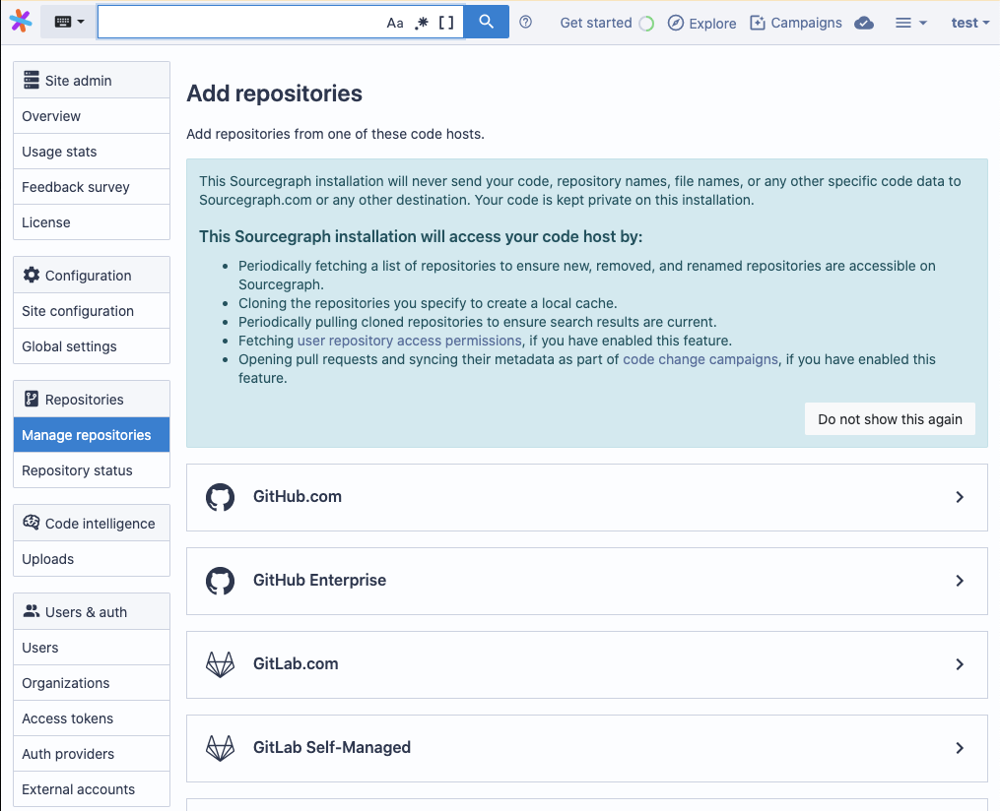

# Improved add / update repository flow for users trying private versions of Sourcegraph (#[11044](https://github.com/sourcegraph/sourcegraph/issues/11044))

Developer: [Loïc Guychard](https://github.com/lguychard)

When you’re getting started setting up a Sourcegraph instance, it can be confusing to start the process of adding a code host. You may not be sure that Sourcegraph
will protect the privacy of your data because there is no communication about how the software will interact with your repositories. We’ve added a new language in
Sourcegraph 3.18 that clarifies what information we access within the Sourcegraph UI so you can move forward with confidence.

## Campaigns now support GitLab (#[11586](https://github.com/sourcegraph/sourcegraph/issues/11586))
Developer: [Adam Harvey](https://github.com/LawnGnome)

You asked, we implemented. We’ve received a lot of feedback from developers using GitLab as their code hosts that campaign capabilities would be useful, so we added
them in the Sourcegraph 3.18 release. This makes campaigns available to more organizations and helps make Sourcegraph more universal. See Adam’s introductory video below:

Campaigns allow you to make large-scale code changes across many repositories and different code hosts, and monitor their progress. For more information on campaign, see the
[Sourcegraph documentation](https://docs.sourcegraph.com/user/campaigns).

## Highlight all elements on hover (#[10868](https://github.com/sourcegraph/sourcegraph/issues/10868))
Developer: [Eric Fritz](https://github.com/efritz)

  

When a token is hovered or selected in a file, we now highlight all visible instances of that token. This makes it easy to see all references of a variable at-a-glance.
Many developers have had to use the browser search (cmd-f) functionality to work around the lack of support of this feature — this makes it first class!
