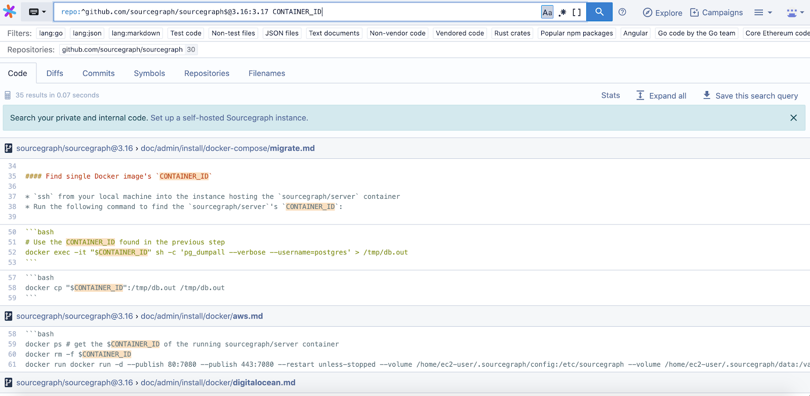
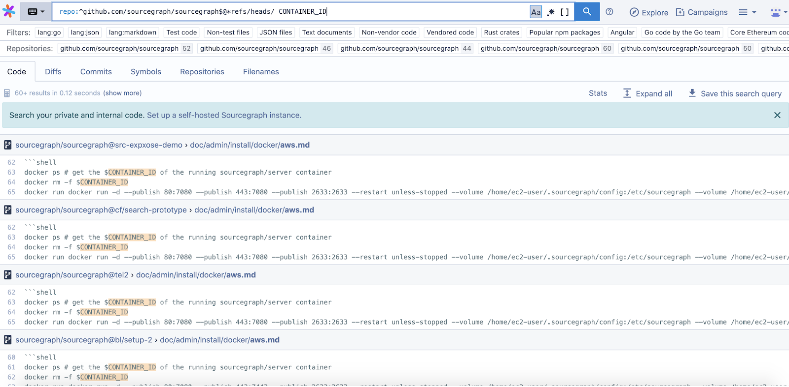

GitHub issue: [#11668](https://github.com/sourcegraph/sourcegraph/issues/11668)

Developer: [Keegan Carruthers-Smith](https://github.com/keegancsmith)

Often, you need to understand the differences between code at different branches (especially for release branches that have diverged).

In Sourcegraph 3.18, you can now search across multiple revisions of the same repository by listing multiple branch names (or other revision specifications) separated by `:` in your query. So to search across multiple specific branches, you’d use something like `repo:myrepo@branch1:branch2:branch2`. To search all branches, use `repo:myrepo@*refs/heads/`.

For example, a search over Sourcegraph versions 3.16 & 3.17 would look something like this

A search over all branches, using [@\*refs/heads/](https://sourcegraph.com/search?q=repo:%5Egithub.com/sourcegraph/sourcegraph%24%40*refs/heads/+CONTAINER_ID&patternType=literal&case=yes) would look like this

Be aware that searching over all branches may be slow. The cost of searching a branch is the same cost as searching a repository. To speed this up, ensure that branches are indexed with our experimental [Indexed non-master branches” feature](add link).
