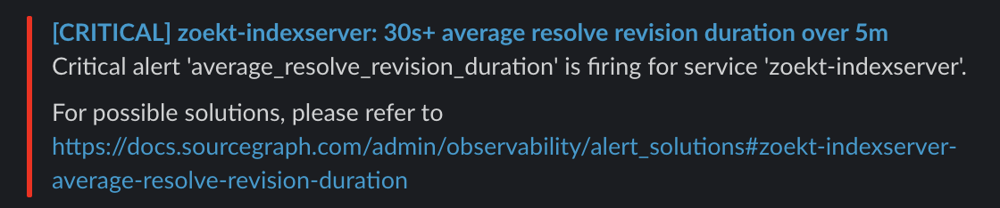

title: 'Getting notified about the health of Sourcegraph is even easier'
author: 'Robert'
publishDate: 2020-07-20T00:00-07:00
tags: ["blog"]
slug: sourcegraph-health-notification
heroImage: https://about.sourcegraph.com/sourcegraph-mark.png
published: true

## Getting notified about the health of Sourcegraph is even easier

Developer: [Robert](https://github.com/bobheadxi)

We continue to make great strides in Sourcegraph’s out-of-the-box monitoring. It is easier than ever before to get notified about critical
issues affecting your Sourcegraph instance. With this, you can quickly set up critical alerts for Sourcegraph’s health to go to Slack,
PagerDuty, Email, OpsGenie, and Webhook notifications.

Alerts are now delivered with detailed information and include links to potential solutions:

Additionally, we now monitor container health and over/under provisioning in all deployment modes - so you will even get alerts if Sourcegraph
needs more resources or could do with less!

To get started with alerting, refer to [our documentation](https://docs.sourcegraph.com/admin/observability/alerting). If you run into any issues
 or questions, please [let us know](https://github.com/sourcegraph/sourcegraph/issues/new/choose)!
