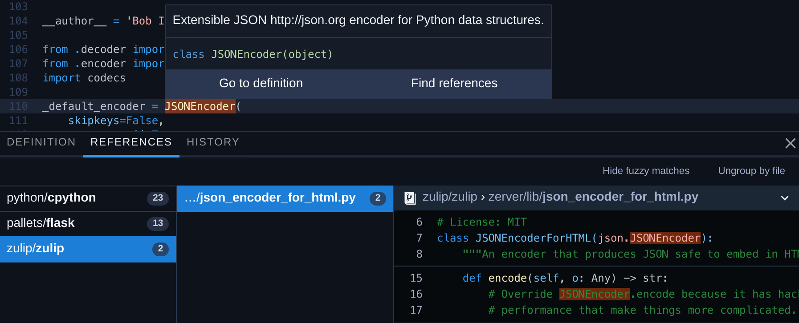

# Sourcegraph 3.0-beta available

The beta release of Sourcegraph 3.0 is now available (as version tag `3.0.0-beta`). Sourcegraph is an open-source, self-hosted code search and browsing tool for teams, with an efficient web interface and feels-like-native integration into your code host. This release comes with several big core updates:

- [Search query cheatsheet](#search-query-cheatsheet): click <kbd>?</kbd> next to the search button to see how to write search queries to find what you need.
- [Basic code intelligence for all languages](#basic-code-intelligence-for-all-languages): fast go-to-definition and find-references for code in any language, using text-based heuristics.
- [More Sourcegraph extension APIs](#more-sourcegraph-extension-apis): add more features and info to code on Sourcegraph and your code host.
- [Extension registry improvements](#extension-registry-improvements): discover and manage Sourcegraph extensions.
- [Management console and site config improvements](#management-console-site-config-improvements): an easier, failsafe web interface for editing site config (works on clusters, too).
- [Deploy to more kinds of clusters](#deploy-to-more-kinds-of-clusters): if our existing 1-Docker-container or Kubernetes deployment schemes don't work for you.
- [Authentication and repository permissions from GitHub](#authenticate-via-github): allow user sign-in and enforce repository access permissions from GitHub or GitHub Enterprise.
- [Faster page load times](#faster-page-load-times): 50% smaller initial bundle size.
- [Nginx-based HTTP configuration](#nginx-based-web-server): for ease of deployment, all HTTP configuration (TLS, listen ports, etc.) is now handled by Nginx instead of being built into Sourcegraph.

Several new and improved [Sourcegraph extensions](https://docs.sourcegraph.com/extensions) add features we think you'll like:

- [Basic code intelligence for all languages](#basic-code-intelligence-for-all-languages): fast go-to-definition and find-references for code in any language, using effective, zero-configuration heuristics when precise analysis is not configured. (Also mentioned above.)
- [Datadog metrics](#datadog-metrics): easily jump to Datadog metrics information from statsd calls in your code.
- [JavaScript/TypeScript language support](https://sourcegraph.com/extensions/sourcegraph/lang-typescript)
- [Go language support](https://sourcegraph.com/extensions/sourcegraph/lang-go)
- [Python language support](https://sourcegraph.com/extensions/sourcegraph/python)
- [Java language support](https://sourcegraph.com/extensions/sourcegraph/lang-java)

Want to hear about new features and releases as soon as they're available? Follow [@srcgraph](https://twitter.com/srcgraph).

## Highlights

### Search query cheatsheet

We want anyone to be able to start using Sourcegraph for code search without reading a manual. That's why we made Sourcegraph search super fast and added one-click query suggestions (computed locally using heuristics) to refine your query.

But when you're searching more than a couple times daily, learning Sourcegraph's search keywords (such as `repo:`) will make you more productive. Click the new <kbd>?</kbd> icon next to any search button to see a quick reference. See ["Search query syntax"](https://docs.sourcegraph.com/user/search/queries) for more info.

### Basic code intelligence for all languages

Two of the most common questions developers have while reading code are:

- "Where is this thing defined?"
- "What calls/uses this thing?"

The [sourcegraph/basic-code-intel](https://sourcegraph.com/extensions/sourcegraph/basic-code-intel) extension adds go-to-definition and find-references support for all languages to answer these questions for you, when browsing any codebase and with zero configuration.

It uses text search and heuristics to provide results, instead of actually compiling and analyzing the code (as most [other language extensions](https://sourcegraph.com/extensions?query=category%3A%22Programming+languages%22) do). This means it's super fast and needs zero configuration, but it's not precise.

For example, if multiple functions in your code are named `open`, the reference results for `open` will include false positives. As long as you're aware of this limitation, it's so fast and helpful in most cases that we think you'll like it. (And if not, toggle it off temporarily in the command palette or disable the extension completely--it's an optional feature.)

The sourcegraph/basic-code-intel extension is enabled for all users by default on [Sourcegraph.com](https://sourcegraph.com). To enable it on your own Sourcegraph instance, go to **User menu > Extensions** and search for `sourcegraph/basic-code-intel` ([more info](https://sourcegraph.com/extensions/sourcegraph/basic-code-intel#usage)).

### More Sourcegraph extension APIs

We introduced new APIs for [Sourcegraph extensions](https://docs.sourcegraph.com/extensions) to add functionality to Sourcegraph and your code hosts. The full API is defined in [`sourcegraph.d.ts`](https://sourcegraph.com/github.com/sourcegraph/sourcegraph/-/blob/packages/sourcegraph-extension-api/src/sourcegraph.d.ts).

- Progress notification (`sourcegraph.app.activeWindow.withProgress(...)` and `showProgress(...)`): extensions can show a window-level loading indicator for long-running tasks.
- Light and dark color theme options for decorations ([`TextDocumentDecoration#light`](https://unpkg.com/sourcegraph/dist/docs/interfaces/_sourcegraph_.textdocumentdecoration.html#light) and [`TextDocumentDecoration#dark`](https://unpkg.com/sourcegraph/dist/docs/interfaces/_sourcegraph_.textdocumentdecoration.html#dark)): when decorating code files with text and links, extensions can specify different colors to use depending on the prevailing UI theme (dark or light) to ensure sufficient contrast.
- Text selection ranges ([`CodeEditor#selections`](https://unpkg.com/sourcegraph/dist/docs/interfaces/_sourcegraph_.codeeditor.html#selections)): extensions can determine the currently selected range (or ranges, for multiple selections).
- Workspace roots ([`sourcegraph.app.activeWindow.roots`](https://unpkg.com/sourcegraph/dist/docs/modules/_sourcegraph_.workspace.html#roots) and [`onDidChangeRoots`](https://unpkg.com/sourcegraph/dist/docs/modules/_sourcegraph_.workspace.html#ondidchangeroots)): extensions can determine the currently active repository and subscribe to changes (i.e, when the user navigates to a different repository or revision).
- Custom panels ([`sourcegraph.app.createPanelView`](https://unpkg.com/sourcegraph/dist/docs/modules/_sourcegraph_.app.html#createpanelview)): extensions can define custom tabs in the panel, in addition to the standard definition and references tabs, such as for showing implementations, type definitions, and other information. The content can be a list of locations or arbitrary Markdown.
- Streaming locations: providers (for references, definitions, and other kinds of locations) can now also return an observable, which lets them "stream" references in. Previously, they could only return an array or promise, so they were limited to a single result set.
- Query transformers ([`sourcegraph.search.registerQueryTransformer`](https://unpkg.com/sourcegraph/dist/docs/modules/_sourcegraph_.search.html#registerquerytransformer)): extensions can define query transformers to implement custom search keywords, such as transforming [`js.depends:react`](https://sourcegraph.com/extensions/sourcegraph/js-dependency-search) to a query matching JavaScript/TypeScript files that import the `react` package.
- [`panel/toolbar` menu contribution point](https://docs.sourcegraph.com/extensions/authoring/contributions#menus): extensions can add actions that are shown in the panel (above references and definitions). This is useful for actions that affect the result set of references or definitions, such as changing which types of references are shown (e.g., function calls only vs. all uses).
- [Extension deactivation](https://docs.sourcegraph.com/extensions/authoring/activation#deactivation): this allows extensions to be cleanly unloaded when they are not in use, so that Sourcegraph runs smoothly for users.
- [Builtin commands](https://docs.sourcegraph.com/extensions/authoring/builtin_commands): these perform useful actions in Sourcegraph, such as updating a user's settings and accessing the [Sourcegraph GraphQL API](https://docs.sourcegraph.com/api/graphql).
<!--
Mention this when the search result provider extension API is released.

- [`searchFilters` contribution](https://docs.sourcegraph.com/extensions/authoring/contributions#search-filters): extensions can add static search filters to suggest additions to a user's query.
-->

We shipped other improvements to the extension development process:

- [`npm init @sourcegraph/extension` extension generator](https://docs.sourcegraph.com/extensions/authoring/creating): easily create the skeleton of a new Sourcegraph extension.
- [Sideload extensions](https://docs.sourcegraph.com/extensions/authoring/local_development): you can now run extensions during development by just entering a URL instead of needing to publish a WIP extension.
- [WIP extensions](https://docs.sourcegraph.com/extensions/authoring/publishing#wip-extensions): an extension whose package.json contains `"wip": true` is marked as a work-in-progress so that users don't inadvertently install it.
- [Extension categories and tags](https://docs.sourcegraph.com/extensions/authoring/manifest#fields): these help users find your extension.

The [Sourcegraph extensions authoring documentation](https://docs.sourcegraph.com/extensions/authoring) also got some new tutorials:
  - [Building a "Hello, world" extension](https://docs.sourcegraph.com/extensions/authoring/tutorials/hello_world)
  - [Adding buttons and custom commands](https://docs.sourcegraph.com/extensions/authoring/tutorials/button_custom_commands)
  - [Building an extension for a language](https://docs.sourcegraph.com/extensions/authoring/tutorials/lang_specific_extension_tutorial)

### Extension registry improvements

The [Sourcegraph.com extension registry](https://sourcegraph.com/extensions) lists all publicly available [Sourcegraph extensions](https://docs.sourcegraph.com/extensions). You can also access it on your own Sourcegraph instance at **User menu > Extensions**. Here's what's new:

- [Extension categories and tags](https://docs.sourcegraph.com/extensions/authoring/manifest#fields): use the [**Category** dropdown](https://sourcegraph.com/extensions) or `tag:mytag` extension query keyword to filter the list of extensions. For example, see ["Programming languages" category](https://sourcegraph.com/extensions?query=category%3A%22Programming+languages%22) and ["javascript" tag](https://sourcegraph.com/extensions?query=tag%3Ajavascript).
- Show enabled/disabled extensions: use the [**Options** dropdown](https://sourcegraph.com/extensions) to show only extensions that are enabled (or disabled) for your user account. This makes it easier to manage your in-use extensions.
- [WIP extensions](https://docs.sourcegraph.com/extensions/authoring/publishing#wip-extensions): extensions that are marked as work-in-progress by the author are indicated as such and are shown last in the list of results.

### Management console and site config improvements

TODO(sqs)

### Deploy to more kinds of clusters

TODO(sqs)

### Authentication and repository permissions from GitHub

TODO(sqs)

### Faster page load times

TODO(sqs)

### Nginx-based HTTP configuration

TODO(sqs)

### Datadog metrics

TODO(sqs)

## Documentation

The [main docs.sourcegraph.com page](https://docs.sourcegraph.com/) was reorganized to make the most common documentation easier to get to. We've also added a lot more documentation pages throughout.

## Engineering

This release includes more solid foundations for several Sourcegraph features:

- [Sourcegraph extensions](https://docs.sourcegraph.com/extensions) are the sole source of code intelligence now. We removed the old way, which required a lot more Sourcegraph-specific custom integration work to add or configure a new language.
- The [management console](https://docs.sourcegraph.com/admin/management_console) makes it so that all configuration can be edited online and in-band, which means future Sourcegraph releases can auto-migrate their own config instead of requiring manual (and error-prone) steps by the site admin.
- The new concept of [external service connections](https://docs.sourcegraph.com/admin/repo/add) will allow us to improve Sourcegraph's synchronization of repositories in a future release.
- Standardizing on Nginx for serving HTTP lets us remove a lot of complex core code to support numerous use cases better handled by Nginx.

## Thank you

## Install or upgrade

Ready to install or upgrade?

- **For new Sourcegraph instances:** [Install Sourcegraph 3.0 beta.](https://docs.sourcegraph.com/#quickstart) This beta release is recommended for new instances that are not upgrading from 2.x.
- **For existing Sourcegraph 2.x instances:** Wait a few weeks for the non-beta [3.0 release](https://docs.sourcegraph.com/dev/roadmap#3-0) (early Feb 2019), for a smooth 2.x-to-3.0 upgrade process.

See [known issues to be fixed before 3.0 release](https://github.com/sourcegraph/sourcegraph/issues?q=is%3Aissue+is%3Aopen+sort%3Aupdated-desc+milestone%3A3.0), and file any issues you encounter there.

---

From the entire Sourcegraph team ([@srcgraph](https://twitter.com/srcgraph)), happy coding!
