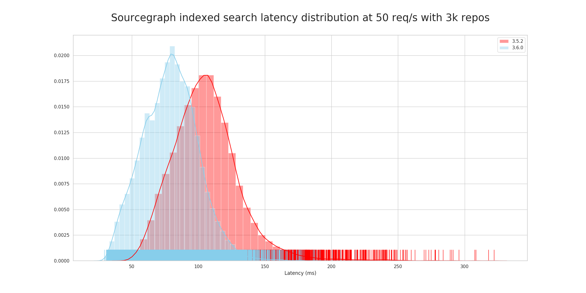

[Sourcegraph](https://about.sourcegraph.com/) is the standard developer platform for code search and navigation at many of the largest and most exacting technology companies. With Sourcegraph, every company has access to the same kind of tools that Google and Facebook developers use every day.

<div style="padding-left: 2rem">

[**🌎 Sourcegraph plugin provides native code intelligence to Bitbucket Server**](#sourcegraph-plugin-provides-native-code-intelligence-to-bitbucket-server)<br />

[**📉 30% indexed search latency improvement for small and medium instances**](#30-indexed-search-latency-improvement-for-small-and-medium-instances)<br />

[**🔗 New customizable quick links for frequently used code searches or other URLs**](#new-customizable-quick-links-for-frequently-used-code-searches-or-other-urls)<br />

[**☁️ New repository syncing support for Bitbucket Cloud**](#new-repository-syncing-support-for-bitbucket-cloud)<br />

[**🛠 Improved repository syncing progress UI**](#improved-repository-syncing-progress-ui)<br />

[**🙅‍♀️ Exclude rules for GitHub repository sync configuration now support regexp**](#exclude-rules-for-github-repository-sync-configuration-now-support-regexp)<br />

[**✈️ Meet the team at GopherCon 2019!**](#meet-the-team-at-gophercon-2019)<br />

[**📝 Changelog**](#36-changelog)<br />

[**🎖️ Thank you**](#thank-you)<br />

</div>

**Deploy or upgrade:** [Local](https://docs.sourcegraph.com/#quickstart-guide) | [AWS](https://github.com/sourcegraph/deploy-sourcegraph-aws) | [DigitalOcean](https://marketplace.digitalocean.com/apps/sourcegraph?action=deploy&refcode=48dfb3ccb51c) | [Kubernetes cluster](https://github.com/sourcegraph/deploy-sourcegraph)

## Sourcegraph plugin provides native code intelligence to Bitbucket Server

TO DO: VIDEO

<!--
<p class="container">
  <div style="padding:56.25% 0 0 0;position:relative;">
    <iframe src="https://player.vimeo.com/video/{ID}?color=0CB6F4&amp;title=0&amp;byline=" style="position:absolute;top:0;left:0;width:100%;height:100%;" frameborder="0" webkitallowfullscreen="" mozallowfullscreen="" allowfullscreen=""></iframe>
  </div>
  <p style="text-align: center"><a href="https://vimeo.com/{ID}" target="_blank">View on Vimeo</a></p>
</p>
-->

Admins can now install the [Sourcegraph for Bitbucket Server plugin](https://github.com/sourcegraph/bitbucket-server-plugin) on their Bitbucket Server instance to provide code intelligence automatically to their teams. Code intelligence, previously available only through the browser extension, includes hovers, tooltips, and line decorations while browsing and reviewing code in Bitbucket Server.

Previously, many users were not aware of the Sourcegraph browser extension. Now, admins can provide an easier onboarding path for all team members who want to browse or review code on Bitbucket Server.

There are two configuration steps:

1. Install the [Sourcegraph for Bitbucket Server plugin](https://github.com/sourcegraph/bitbucket-server-plugin)
2. Update the [Bitbucket Server external service configuration](https://docs.sourcegraph.com/admin/external_service/bitbucket_server#native-extension) in your Sourcegraph instance to include `”corsOrigin”: “<bitbucket server url>”`

## 30% indexed search latency improvement for small and medium instances



We have made several changes to our search algorithm that improve performance and reduce peak memory usage. Our benchmarks show that the **99th percentile latency** of indexed searches in small to medium instances (less than 3000 repositories) **is reduced by up to 30%**. We will be continuing work to further benchmark and optimize Sourcegraph for our customers with 30,000+ repositories.

## New customizable quick links for frequently used code searches or other URLs

TO DO: VIDEO

<!--
<p class="container">
  <div style="padding:56.25% 0 0 0;position:relative;">
    <iframe src="https://player.vimeo.com/video/{ID}?color=0CB6F4&amp;title=0&amp;byline=" style="position:absolute;top:0;left:0;width:100%;height:100%;" frameborder="0" webkitallowfullscreen="" mozallowfullscreen="" allowfullscreen=""></iframe>
  </div>
  <p style="text-align: center"><a href="https://vimeo.com/{ID}" target="_blank">View on Vimeo</a></p>
</p>
-->

[Quick links](https://docs.sourcegraph.com/user/quick_links) can now be added below the search bar on the home page and search results page. This makes it easier for teams to quickly access the Sourcegraph pages they care most about such as your team’s main repository, or have easy access to external resources like your CI system or team documentation.

Add a quick link to global, organization, or user settings with the `quicklinks` field:

```
{
  // ...
  "quicklinks": [
    {
      "name": "Sourcegraph docs",
      "url": "https://docs.sourcegraph.com"
    },
    {
      "name": "Main repository",
      "url": "/github.com/sourcegraph/sourcegraph"
    }
  ]
  // ...
}
```

## New repository syncing support for Bitbucket Cloud

TO DO: VIDEO

<!--
<p class="container">
  <div style="padding:56.25% 0 0 0;position:relative;">
    <iframe src="https://player.vimeo.com/video/{ID}?color=0CB6F4&amp;title=0&amp;byline=" style="position:absolute;top:0;left:0;width:100%;height:100%;" frameborder="0" webkitallowfullscreen="" mozallowfullscreen="" allowfullscreen=""></iframe>
  </div>
  <p style="text-align: center"><a href="https://vimeo.com/{ID}" target="_blank">View on Vimeo</a></p>
</p>
-->

Previously, Bitbucket Cloud repositories had to be added and configured as individual git repositories. In Sourcegraph 3.6 we added first class support for connecting [Bitbucket Cloud repositories](https://docs.sourcegraph.com/admin/external_service/bitbucket_cloud). In this release, all repositories will be added for the username configured, and teams listed that the Bitbucket Cloud app password grants access to.

## Improved repository syncing progress UI

TO DO: Updated video (should we mark the 3.5 video as deprecated?)

<!--
<p class="container">
  <div style="padding:56.25% 0 0 0;position:relative;">
    <iframe src="https://player.vimeo.com/video/{ID}?color=0CB6F4&amp;title=0&amp;byline=" style="position:absolute;top:0;left:0;width:100%;height:100%;" frameborder="0" webkitallowfullscreen="" mozallowfullscreen="" allowfullscreen=""></iframe>
  </div>
  <p style="text-align: center"><a href="https://vimeo.com/{ID}" target="_blank">View on Vimeo</a></p>
</p>
-->

Admins no longer have to wait for an external service to finish syncing before navigating away from the configuration page. Previously, this was problematic for customers adding external services with lots of repositories. Now, the syncing continues in the background and progress is shown to admins in the global navigation bar’s syncing status indicator.

The experimental repository syncing status indicator announced in 3.5 has been improved enough to turn this feature on for all site admins by default. Improvements include handling scale of 30,000+ repositories, and only showing the number of repositories remaining to be cloned.

## Exclude rules for GitHub repository sync configuration now support regexp

The `github.exclude` setting in [GitHub external service config](https://docs.sourcegraph.com/admin/external_service/github#configuration) has been expanded to handle regular expressions using `{"pattern": "^topsecretrepogroup/.*"}`.

Previously, only names or IDs could be specified. Now, it is easier to exclude entire groups of repositories, such as repositories containing secrets, or data projects that aren’t relevant for code browsing.

## Meet the team at GopherCon 2019!

Our remote-first team from around the world is coming together at GopherCon next week. We are looking forward to seeing our friends in the Go community, so make sure to find us while you’re there!

## 3.6 Changelog

### Added

- The `github.exclude` setting in [GitHub external service config](https://docs.sourcegraph.com/admin/external_service/github#configuration) additionally allows you to specify regular expressions with `{"pattern": "regex"}`.
- A new [`quicklinks` setting](https://docs.sourcegraph.com/user/quick_links) allows adding links to be displayed on the homepage and search page for all users (or users in an organization).
- Compatibility with the [Sourcegraph for Bitbucket Server](https://github.com/sourcegraph/bitbucket-server-plugin) plugin.
- Support for [Bitbucket Cloud](https://bitbucket.org) as an external service.

### Changed

- Updating or creating an external service will no longer block until the service is synced.
- The GraphQL fields `Repository.createdAt` and `Repository.updatedAt` are deprecated and will be removed in 3.8. Now `createdAt` is always the current time and updatedAt is always null.
- In the [GitHub external service config](https://docs.sourcegraph.com/admin/external_service/github#configuration) and [Bitbucket Server external service config](https://docs.sourcegraph.com/admin/external_service/bitbucket_server#permissions) `repositoryQuery` is now only required if `repos` is not set.
- Log messages from query-runner when saved searches fail now include the raw query as part of the message.
- The status indicator in the navigation bar is now enabled by default
- Usernames and org names can now contain the `.` character. [#4674](https://github.com/sourcegraph/sourcegraph/issues/4674)

### Fixed

- Commit searches now correctly highlight unicode characters, for example 加. [#4512](https://github.com/sourcegraph/sourcegraph/issues/4512)
- Symbol searches now show the number of symbol matches rather than the number of file matches found. [#4578](https://github.com/sourcegraph/sourcegraph/issues/4578)
- Symbol searches with truncated results now show a `+` on the results page to signal that some results have been omitted. [#4579](https://github.com/sourcegraph/sourcegraph/issues/4579)

## Thank you

Thank you to the many people who contributed to Sourcegraph since the last release!

- [@abeyerpath](https://github.com/abeyerpath)
- [@PostPollux](https://github.com/PostPollux)
- [@devil418](https://github.com/devil418)
- [@ceecurvin](https://github.com/ceecurvin)
- [@dwgillies](https://github.com/dwgillies)
- [@yevbar](https://github.com/yevbar)
- [@alanhamlett](https://github.com/alanhamlett)
- [@linknum23](https://github.com/linknum23)

---

**Deploy or upgrade:** [Local](https://docs.sourcegraph.com/#quickstart-guide) | [AWS](https://github.com/sourcegraph/deploy-sourcegraph-aws) | [DigitalOcean](https://marketplace.digitalocean.com/apps/sourcegraph?action=deploy&refcode=48dfb3ccb51c) | [Kubernetes cluster](https://github.com/sourcegraph/deploy-sourcegraph)

From the entire Sourcegraph team ([@srcgraph](https://twitter.com/srcgraph)), happy coding!
