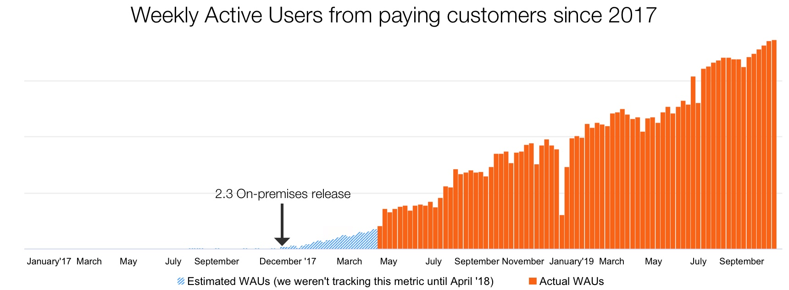
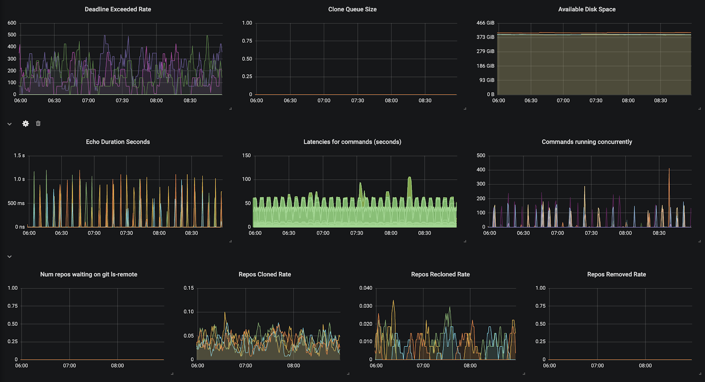
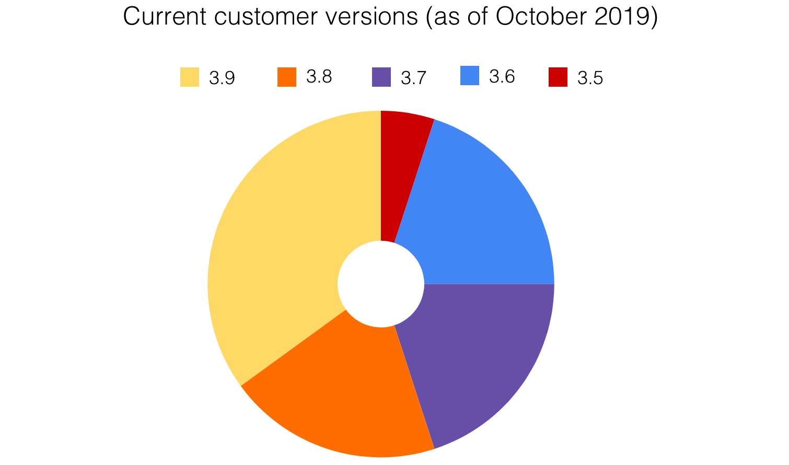

 **“Trust is great. Control is better.”** - German proverb

In December 2017, Sourcegraph went from being a traditional cloud-hosted Software as a Service (SaaS) product to an on-premises, self-hosted product. This blog post covers what drove our decision and what challenges we encountered. It explains why we still believe that on-premises and self-hosted are the best way to ensure the success of a product dealing with sensitive customer data. We will focus on the technical benefits and challenges of this decision, some of which overlap with the positive business aspects that are mentioned in the [Self-hosted > cloud-hosted](https://docs.google.com/presentation/d/1SpTssaLfALx3SIQj5xkA0ZO8l_6tcuLacQtMqeJubo4) ([Open Core Summit 2019](https://opencoresummit.com/))(https://opencoresummit.com/) talk by Sourcegraph CEO Quinn Slack.

## Going against the SaaS trend
2017 was a challenging year for Sourcegraph. Despite having launched a SaaS product that performed code search and code intelligence with blazing speed across tens of thousands of repositories, we had only managed to close a handful of paying customers. Companies were constantly reaching out and requesting information about our product, which, in turn, endorsed the high demand for Sourcegraph. Yet, the conversion from interest to adoption was low. We asked company decision makers why they had opted against using Sourcegraph despite the obvious demand from their engineers. The answer was always the same: they didn’t want to push their private code base to an external software provider, no matter how many benefits we would provide them. This frequent feedback made us question if the SaaS model, despite its popularity and high success rate for many businesses, was the right solution for a product dealing with vulnerable data.
In mid 2017, we decided to go against the SaaS trend and turn our product into an on-prem, self-hosted solution.

## The transition from cloud SaaS to on-prem
While a decade ago on-premises solutions were difficult to setup and required on-site installation, Continuous Integration (CI) has made it possible to verify builds in different environments and increase successful deployments off-site. [Docker](https://docs.sourcegraph.com/admin/install/docker) (for shipping) and [Kubernetes](https://github.com/sourcegraph/deploy-sourcegraph) (for container orchestration) simplify packaging up software and running it on [AWS](https://docs.sourcegraph.com/admin/install/docker/aws), [Google Cloud](https://docs.sourcegraph.com/admin/install/docker/google_cloud) or [DigitalOcean](https://docs.sourcegraph.com/admin/install/docker/digitalocean). This infrastructure eased the way for Sourcegraph to transition from a Software as a Service to a self-hosted product.

To make it simple for our customers to stay on the latest Sourcegraph version, we optimized the updating process with the following changes:

- We moved from continuous delivery to monthly iteration cycles.
- We emphasized feature development to encourage keeping up with the newest Sourcegraph version. We also have policies that ask customers to stay on the newest versions.
- We established a standard release testing process to better detect bugs in our releases.
- We wrote [better docs](https://docs.sourcegraph.com/admin/install) to tackle the challenge of running Sourcegraph smoothly on different environments.

## Code Base Security
Many of our customers have high security requirements and don’t feel comfortable uploading their private code to an external cloud software provider. They prefer a solution that can run on their own infrastructure, under their own security terms and authorization mechanisms, with full control over who has access. Since the release of Sourcegraph 2.3 as an on-premises, self-hosted product, we’ve experienced much higher Sourcegraph adoption rates for enterprise usage.

Companies can deploy in-house without exposing their code to Sourcegraph employees or other providers. This allows anyone at a company to start running Sourcegraph locally and hassle-free, instead of needing to ask permission to source out the codebase up to an unauthorized cloud infrastructure provider.

## Ensuring Scalability and Performance
The performance of locally run software depends mostly on how much hardware the customer is willing to allocate. The benefit for on-premises software here is that, contrary to SaaS, companies aren’t restrained to a one-size-fits-all performance framework, but can scale the software based on the best hardware that best suits their needs and resources. Sourcegraph is able to work with the existing infrastructure of our customers, and scale and perform accordingly. 
On the flip side, Sourcegraph has to tackle the diverse challenges that come with running a software compatible in different environments.

## All infrastructure is visible
By running on-premises, our DevOps work is exposed to the customer, making them aware of the quality of our code. From our point of view, this is a blessing in disguise and helps us set our expectations higher for quality and documentation.

Occasionally, things go wrong. One of the challenges of dealing with customer hosted software is that the debugging process requires access to their error logs, alerts, local configuration, deployment environment, and more. To overcome this hurdle, we have improved Sourcegraph’s observability, building [logging and metrics](https://docs.sourcegraph.com/admin/monitoring_and_tracing) into the application to give more information about the root cause of bugs. Fortunately, our customers have been quick to alert us whenever there was an issue.

## Conclusion
Switching from SaaS to on-premises was essential for Sourcegraph to become the de facto developer platform that all engineers use among top companies like Lyft, Uber, Plaid, Convoy and many more. Our main challenges are maintaining high standards for our code quality to reduce the more tedious debugging process of an on-premises solution and ensuring Sourcegraph runs smoothly in different environments. The majority of our customers run fairly up-to-date Sourcegraph versions. We are able to achieve this by making our upgrade process as simple as possible and communicating our enticing new features to our customers. 

While SaaS may be the right solution for a variety of products, providing on-premises deployment turned out to be the deciding factor for security-conscious companies to adopt Sourcegraph.
