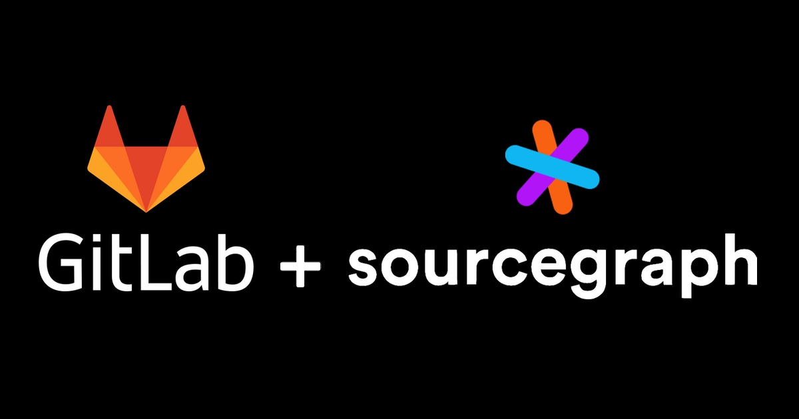

  

**"Every single developer that used Sourcegraph and talked to me about it loved the product. Every code product must have intelligent navigation."** - [Sid Sijbrandij, GitLab CEO](https://news.ycombinator.com/item?id=18118924)
 
 
Over 100,000 organizations use GitLab to manage their DevOps lifecycle. Today GitLab announced a collaboration with Sourcegraph to make code navigation and code intelligence available to all GitLab users, integrated seamlessly in the GitLab developer workflow and user interface.

## Developers need code navigation and code intelligence 

Developers have always relied on go-to-definition and find-references functionality in the editor. Development becomes more collaborative and complex, and developers spend more hours per day reading and reviewing code on their code host. GitLab realized that these code navigation and code intelligence features are essential to have in the code host and at code review, not just in the editor. 

Sourcegraph provides these much-loved, much-used features at scale for all code organization-wide—across repositories and for all popular programming languages and code hosts. The world's most elite technology companies rely on Sourcegraph, including Lyft, Uber, Yelp, Convoy, SoFi, and Quantcast.

With many happy customers in common, a shared focus on developers, and some [CEO-to-CEO discussion on Hacker News](https://news.ycombinator.com/item?id=18118924), GitLab chose Sourcegraph to deeply integrate these essential code navigation and code intelligence features for the 100,000+ organizations who trust GitLab.

  

    <iframe src="https://player.vimeo.com/video/372226334?color=0CB6F4&amp;title=0&amp;byline=" style="position:absolute;top:0;left:0;width:100%;height:100%;" frameborder="0" webkitallowfullscreen="" mozallowfullscreen="" allowfullscreen=""></iframe>
  

  
<a href="https://vimeo.com/372226334" target="_blank">View on Vimeo</a>

## Built-in IDE-like features improve code reviews

Code reviews become higher quality when developers have more context about the code they are reviewing. With this new integration, developers can traverse the code they are reviewing in the browser, investigate the impact of code changes thoroughly by finding all affected references and complete their code reviews faster.

Higher-quality code reviews mean fewer bugs, and more time spent on building new features. Making open-source code easier to read and understand means faster identification of vulnerabilities, a better understanding of libraries, and less duplicated code. 

Together, GitLab and Sourcegraph are creating a better world for enterprise and open source developers, consumers, and organizations.

## When you can opt-in

Sourcegraph code intelligence and code navigation will be available on November 20th for GitLab.com and November 30th for enterprise instances.

## FAQ
**What does this mean for the future of the browser extension?**
 
Until now, to get these features integrated seamlessly into their code host, users needed to install our popular [Sourcegraph for Chrome/Firefox extensions](https://docs.sourcegraph.com/integration/browser_extension) or install server-side extensions.
The browser extension still exists and supports GitHub, GitLab, Bitbucket server, Phabricator, etc. This new integration just makes it so all GitLab users can get code navigation and code intelligence on GitLab without needing to install anything.

**When will other code hosts get this treatment?**
 
Code navigation and code intelligence are essential, so we are working with [other major code hosts](https://docs.sourcegraph.com/integration) to incorporate these features using [open standards](https://docs.sourcegraph.com/integration).

**How does this work for public and private code?** 
 
Soon all public code on GitLab.com will have Sourcegraph code navigation and code intelligence (for users who opt-in). Users of private code on GitLab.com or of self-managed GitLab instances can opt-in and configure GitLab to point to a self-managed Sourcegraph instance.

**What languages does this support?**
 
The integration supports the [25 most used programming languages](https://sourcegraph.com/extensions?query=category%3A%22Programming+languages%22): 
Clojure 
C++ 
C# 
CUDA 
Dart 
Elixir 
Erlang 
Go 
Haskell 
Java 
JavaScript/TypeScript 
Kotlin 
Lisp 
Lua 
OCaml 
Perl 
PHP 
PowerShell 
Python 
R 
Ruby 
Rust 
Scala 
Shell 
Swift
