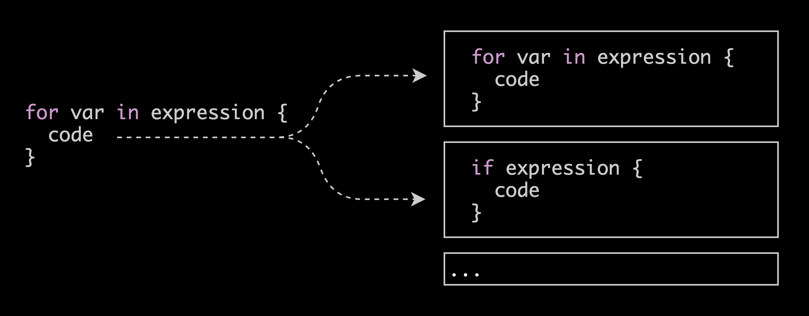

We're introducing a richer way to search code at Sourcegraph with structural
code search. And we're making it available at scale.

## What _is_ structural code search?

Structural code search is the idea that you can search for _syntactic
structures_ in code that correspond more closely to a program's underlying
concrete syntax tree.<sup>1</sup> For example, `for` [loops in
Rust](https://doc.rust-lang.org/1.2.0/book/for-loops.html) look something like
this:

```rust
for var in expression {
    code
}
```

The `code` block can contain nested `for` loops, `if` statements, and so on. If
we wanted to match all of the `code` block contents for these expressions, and
search for patterns inside them, our search engine must understand that `code`
exists inside balanced braces `{ ... }`. Regular expressions can go a
long way to match such syntactic structures but [they are not
ideal](https://stackoverflow.com/questions/1732348/regex-match-open-tags-except-xhtml-self-contained-tags).
In practice we use _parsing_ to interpret and convert syntax for nested
expressions like `{...}` into trees, which encode richer structural properties
than the textual representation.



Most code search today is not based on true parsing or tree data structures.
Instead, we use literal strings or regular expressions, which is "good enough"
for many kinds of searches. But this flavor of text search isn't ideal for
matching nested expressions as in Figure 1. We could more easily and precisely
search for richer syntactic patterns if today's search tools _also_ treated
code as syntax trees, and that's the key idea behind structural search. 

As a feature, the idea is not entirely new. There are some neat developer and
compiler tools that search or match over tree structures already (see
[additional resources](#additional-resources) at the end of this post!). But
none are available at your fingertips, just seconds away from running on some
of today's largest and most popular code bases. That is why we are happy to
announce that Sourcegraph now supports a first release of structural search
available at scale, for nearly every language, directly from your browser.

## Examples! Show me examples!

Search for `++i` [in our codebase](https://sourcegraph.com/search?q=repo:%5Egithub%5C.com/sourcegraph/sourcegraph%24++lang:typescript+%27for+%28:%5Bx%5D+%2B%2Bi%29%27&patternType=structural)

*A couple of things to keep in mind*

- See our [usage documentation](https://docs.sourcegraph.com/user/search/structural) for more help.

- You might be running structural search for the first time on a repo! 😎 If your
query times out, give the page a refresh because we're probably warming up the
cache for you. 

- Need more inspiration? See the [CactusCon Talk](https://www.youtube.com/watch?v=yOZQsZs35FA)

- Have a usage question or suggestion? [Send us a tweet](https://twitter.com/srcgraph) or e-mail us at <feedback@sourcegraph.com>

- Run into a bug? [Create an issue on GitHub](https://github.com/sourcegraph/sourcegraph/issues/new?assignees=&labels=&template=bug_report.md&title=)

## How is this different from regular expressions?

They key differences in functionality are:

- Builtin, convenient constraints `:[x] :[x]`.
- Language-aware (only code, contextual strings)
- Convenient multiline/insignificant whitespace matching
- Delimeters are _always_ balanced, no guesswork involved
- Less metasyntax, less escaping

- No support for `\d+` (see feature improvements).

**When you should use structural search**

Structural search is not a replacement for regexp search. It's another tool in
your toolkit that works well for matching blocks of code or expressions, and
simplifies catching buggy syntactic patterns. If you only want to find a simple
string or pattern, consider using Sourcegraph's literal or regexp
[search](https://sourcegraph.com/search), because these are typically much
faster!

## What's next for structural search?

We have more features and improvements planned. _If you want to see any of
these features arrive more quickly, please +1 the related issue tracker so
that we can prioritize our engineering to deliver them sooner!_

- **Structural search enabled for all mirrored repositories.** We want structural
  search to be available for _your_ repository, and not just the really popular
  ones [+1 this feature on GitHub](https://github.com/sourcegraph/sourcegraph/FIXME).
- **Regular expression support in structural holes.** We want to add support for
  regexp syntax inside holes for refine search, like `\d+` to match only
  numerical digits [+1 this feature on GitHub](https://github.com/sourcegraph/sourcegraph/FIXME).
- **A richer query language.** There are ways to refine structural search with [rules](https://comby.dev/#advanced-usage) allowing richer queries. If you have a use case for this and want support sooner, [+1 this feature on GitHub](https://github.com/sourcegraph/sourcegraph/FIXME).
- **Make it faster.** Structural search is typically slower than our regexp
  search because it does more work. If you find it valuable, we
  want to make it faster [+1 this feature on GitHub](https://github.com/sourcegraph/sourcegraph/FIXME).

Have something else in mind? Send us an e-mail at <feedback@sourcegraph.com>

Happy searching!

---

## Additional resources

There is an immense amount of existing parsing and query tools for syntax
trees. Most compilers today offer a library or visitor framework, and linters
or static analyzers may build on them to implement checks. Here is just a
non-exhaustive, short list of tools related to structural search and matching
that you may be familiar with or find interesting:

- IntelliJ IDE support for structural search and replace, or `SSR` [[1](https://www.jetbrains.com/help/idea/structural-search-and-replace.html)]
- Coccinelle for C code [[1](http://coccinelle.lip6.fr/)]
- `gogrep` for matching Go syntax trees [[1](https://github.com/mvdan/gogrep)]
- `Sgrep`, or Syntactical grep for multiple languages [[1](https://github.com/facebookarchive/pfff/wiki/Sgrep)], [[2](https://github.com/returntocorp/bento/blob/master/SGREP-README.md)]
- `tree-sitter` for parsing multiple language grammars [[1](https://github.com/tree-sitter/tree-sitter)]
- CodeQL for analyzing a number of poular languages [[1](https://securitylab.github.com/tools/codeql)]

At Sourcegraph we're continually looking to improve developer tools, and to
integrate richer search functionality. If you find these tools or others
valuable, share your thoughts with us at <feedback@sourcegraph.com>.

---

[1] Or _parse tree_.


