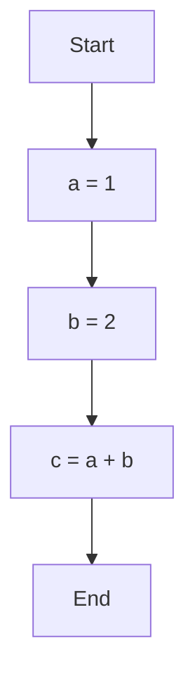

<Alert type="secondary">This is a guest blog post from our community. <a href="https://discord.com/servers/sourcegraph-969688426372825169" target="_blank">Join our Discord</a> to meet the author and connect with other developers passionate about Code Search and AI!</Alert>

In the world of programming, understanding the structure and flow of your code is crucial for maintaining, refactoring, and debugging. While code provides a textual representation of your program's logic, sometimes a visual representation can be more intuitive and helpful. Enter flowcharts – diagrams that map out the flow of execution in your code.

We'll dive into the world of [Mermaid](https://mermaid.js.org) and explore its potential for generating flowcharts. But first, let's address the elephant in the room: what is Mermaid?


### What is Mermaid?

Imagine a tool that enables you to create diagrams and flowcharts using simple text commands. That's the magic of Mermaid, a JavaScript-based charting and diagramming library that transforms plain text into visually appealing diagrams.

Think of it as a modern-day version of cave paintings, where instead of depicting scenes on rock walls, you're using text to paint a picture of your code's structure and flow.


### Using Mermaid with Cody to generate flowcharts

Now that you have a basic understanding of Mermaid, let's explore why combining it with Cody, is a match made in diagramming heaven.

Cody's superpower lies in its ability to analyze code and extract its essential structure. This means that Cody can automatically generate a flowchart of your code, saving you the time and effort of manually creating one.

But here's the twist: Cody doesn't just generate a flowchart; it generates a Mermaid-compatible flowchart. This means that you can seamlessly integrate Cody's flowchart output into Mermaid, allowing you to further customize and refine your diagrams.

In essence, Cody and Mermaid are like two peas in a pod, complementing each other to create a powerful flowcharting duo.


### Benefits of using Cody and Mermaid to generate flowcharts

The benefits of using Cody and Mermaid to generate flowcharts are twofold:

* Save time and effort: Cody automates the flowchart creation process, freeing up your time to focus on more meaningful tasks.

* Enhance understanding: Visualizing your code's structure using flowcharts can significantly improve your understanding of complex codebases.

* Improve communication: Flowcharts serve as excellent communication tools, allowing you to clearly convey code structure to others.

So, if you're looking for a way to streamline your flowcharting process and gain a deeper understanding of your code, Cody and Mermaid are your go-to tools.


### Use Cody to generate a flowchart of a code snippet

Now, let's delve into the exciting task of generating flowcharts from code files. Here we open up a JavaScript file and selecting the following function that serves as an example: 

```js
let a, b, c;
a = 1;
b = 2;
c = a + b;
```

With Cody primed and ready to assist, feed the prompt: 


    > "Hey, Cody, can you generate a flowchart of this selected code snippet in Mermaid format?"

Cody, our trusty AI coding assistant, will spring into action, meticulously analyzing the snippets structure and logic. It will then deftly craft a Mermaid-formatted flowchart, a visual representation of the code's flow and execution path. This flowchart will serve as a valuable tool for grasping the code's inner workings and identifying potential areas for improvement. If you haven't already installed Mermaid, an essential tool for visualizing Mermaid-formatted flowcharts, Cody will provide you with the Mermaid code directly:



Simply copy and paste this code into a Mermaid viewer, and voilà! The flowchart will magically appear before your eyes, revealing the code's intricate dance in all its glory. A Mermaid viewer and editor can be found at [mermaid.live](https://mermaid.live/). If you are using VS Code you can install [this plugin](https://marketplace.visualstudio.com/items?itemName=bierner.markdown-mermaid) which adds Mermaid diagram and flowchart support to VS Code's built-in Markdown preview.

This is the generated flowchart:

<Figure
  src="https://storage.googleapis.com/sourcegraph-assets/blog/guest-blog-post-using-cody-and-mermaid-to-generate-flowcharts.png"
  caption="Cody for VS Code generating Mermaid flowcharts"
/>

This seamless integration between Cody and Mermaid empowers you to visualize your code effortlessly, transforming complex logic into a visually intuitive representation. As you navigate the flowchart, you'll gain a deeper understanding of the code's structure and behavior, enabling you to identify potential areas for optimization and refinement.

### Other use cases with Cody and Mermaid

Cody's talents extend far beyond simply generating flowcharts. Together with Mermaid, Cody empowers you to revolutionize your coding workflow, transforming it into a visual symphony of creativity and efficiency.

Imagine the thrill of effortlessly generating UML diagrams, showcasing the intricate relationships between classes and objects in your code. Cody's expertise in understanding code structures seamlessly translates into Mermaid-formatted UML diagrams, clearly visualizing the code's architecture.

Beyond UML diagrams, Cody's versatility shines through in its ability to generate a variety of diagrams, including sequence diagrams, Gantt charts, and even state diagrams. These diagrams serve as invaluable tools for documenting code behavior, process flows, and state transitions, ensuring that your code remains lucid and well-structured.

<Figure
  src="https://storage.googleapis.com/sourcegraph-assets/blog/guest-post-flowchart-cody-gantt.png"
  caption="Cody: create a Gantt diagram of @.../detect-multiline.ts formatted for Mermaid."
/>

So, go ahead and unleash Cody's flowchart-generating prowess, and watch as your code transforms into a masterpiece of visual clarity. Embrace the power of visual storytelling and let your code flow like a well-designed diagram, a testament to your coding mastery.


<hr style={{marginTop:"2rem",marginBottom:"2rem"}} />

To get started with Cody, check it out on [sourcegraph.com](https://sourcegraph.com/cody).
