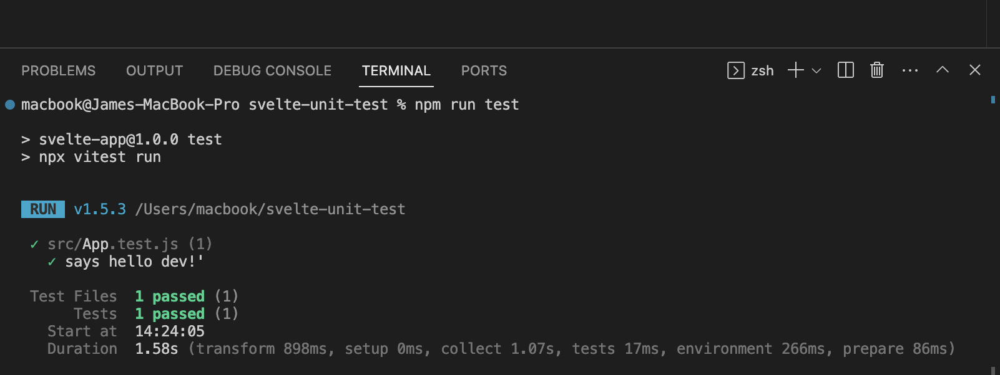
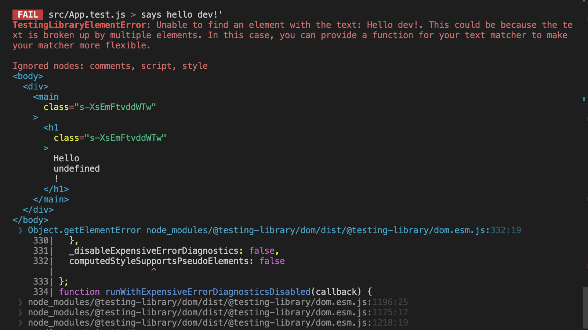
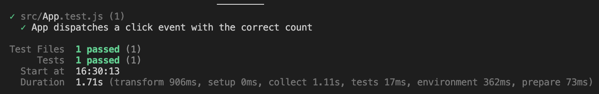
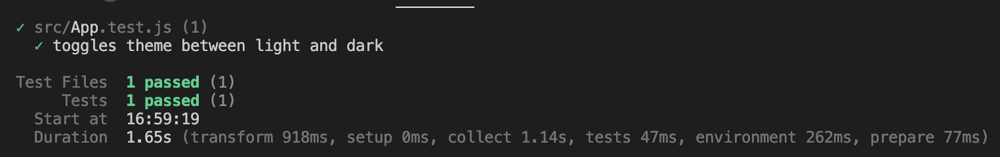
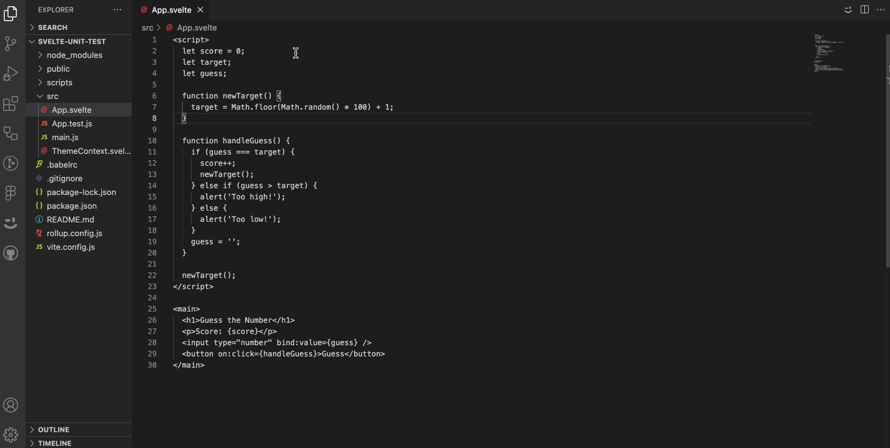

# How to Write Unit Tests for Svelte Web Apps

Writing codes for front end applications is undoubtedly a crucial aspect in the development of an application. However, an equally crucial aspect developers often overlook is writing tests for an application. The usability of an application is one of the main factors you should consider in development, so it is important to ensure an application is bug-free, of the best code quality, and works efficiently. We can verify this factor through testing, which basically entails testing our application to ensure it works as expected just before it gets to the end user.

In this article, you will learn about writing unit tests in [Svelte](https://svelte.dev/), a JavaScript framework.

## Prerequisites

This article will break down complex concepts in a manner that is easily understood. However, a knowledge of the following will be beneficial:

* Knowledge of [JavaScript](https://developer.mozilla.org/en-US/docs/Web/JavaScript)
* Knowledge of [Svelte](https://svelte.dev/)
* [Node.js](https://nodejs.org/en) installed on your computer

## Unit Testing — What’s that About?

If you have no prior knowledge of unit testing and you guessed the meaning to be the testing of unit components, then you’re 80% correct. Just before we dive into unit testing, let’s have a recap on what testing is all about. Testing, a stage in the [Software Development Life Cycle(SDLC)](https://en.wikipedia.org/wiki/Systems_development_life_cycle), entails checking a particular application for bugs and whether or not it meets the customer’s requirements.

Unit Testing is a type of software testing that tests the functionality of the smallest parts of a particular application in isolation or as a **unit**. It ensures individual parts of components of an application work as expected and meets its requirements. In a bit, we’ll see how to implement this functionality and test components in a Svelte application.

## Setting up Our Environment

Now that we have discussed the basic concept of unit testing, we can proceed to set up our Svelte environment. In this tutorial, we’ll be using [degit](https://www.npmjs.com/package/degit?activeTab=dependencies), a project scaffolding tool, to set up our Svelte app. You can do so by running the following command in your terminal:

```
npx degit sveltejs/template svelte-test-app
```
Navigate to the svelte-test-app project directory:
```
cd svelte-test-app
```
Install the dependencies and run the command to execute the starter project:
```
npm install

npm run dev
```

We’ll work with the [Svelte testing library](https://testing-library.com/docs/svelte-testing-library/intro/) and [Vitest](https://vitest.dev/) as a test runner. We can install these libraries by running this command:
```
npm install -D @testing-library/svelte @testing-library/user-event vite vitest
```
Here’s a quick breakdown of the library and tools we have installed in the above code:

- **@testing-library/svelte**: Svelte testing library that provides the basic functionality of rendering svelte test components, querying the output, firing events with the `fireEvent` function, and monitoring updates.
- **@testing-library/user-event**: a library for simulating user events(such as clicking and typing) in testing.
- **Vitest**: a Vite test runner to run our unit tests.

## Further Configurations

Already excited to get started with writing unit tests in Svelte? Just one final bit of configuration and we dive right in! Go to your vite.config.js file and add these configurations to aid the build and test process.

```javascript
import { defineConfig } from "vite";
import { svelte } from "@sveltejs/vite-plugin-svelte";

// https://vitejs.dev/config/
export default defineConfig({
  plugins: [svelte()],
  test: {
    globals: true,
  },
});
```

Finally, in your `package.json` file, add the scripts to run your tests:

```
"test": "npx vitest run",  
"test:watch": "npm run test -- --watch"
```

And we’re all set on the configuration front!

## Working Principle

If you have no experience writing unit tests or tests in general, then this section is for you. What does it really mean to write tests? How does it work? Technically, writing tests entail two stages:

* Writing code to be tested.
* Writing code that describes the expected behaviour of the tested component.

A test is successful and will pass if there’s a perfect match between a component's expected behaviour and the component's actual behaviour. A test will fail if the behaviour of a component does not align with the assertions written in a test. We’ll see how this works in a bit.

## Writing a Basic Unit Test in Svelte

In this section, you’ll see how to write a basic unit test in Svelte. We already established that we must have a component or piece of code to be tested before we proceed to writing tests. Let’s create a simple Svelte component that renders some text:

```javascript
//App.svelte
<script>
  export let name;
</script>

<h1>Hello {name}!</h1>

<style>
  h1 {
    color: blue;
    font-family: 'Comic Sans MS', cursive;
  }
</style>
```
We also write this code in our `main.js` file:

```javascript
import App from "./App.svelte";

const app = new App({
  target: document.body,
  props: {
    name: "Dev",
  },
});

export default app;
```

In this simple piece of code, we dynamically rendered a text that should display “Hello Dev!” in the browser. By performing tests, we can see if this piece of code works and displays in our browser without actually opening the browser. Let’s write a test for this piece of code in Svelte.

```javascript
import { render, screen, } from "@testing-library/svelte";
import "@testing-library/jest-dom/extend-expect";
import App from "./App.svelte";

  test("says hello dev!'", () => {
    render(App);
    expect(screen.getByText("Hello Dev!")).toBeInTheDocument();
  });
```

And voila! We’ve successfully written our first unit test in Svelte. Don’t be scared, I’ll be explaining every bit of this code and we’ll see if the test passes or fails.

First, we import the render and screen functions from the Svelte testing library(remember we installed this earlier). The render function renders the component to be tested into a simulated DOM environment while the screen function allows us to perform operations to query and interact with the rendered component. In simpler terms, the render function provides the component for the screen function to act on it.

The test function takes two arguments; a string which is usually a descriptive name of how the test should behave and the actual function which contains the logic and assertions of the test case. In our test, we have the first argument of the test function as “says hello dev!” which basically implies we should expect the result to be a text that says “Hello Dev!”. It doesn’t end there. The second argument, which you can say is the most important, defines the logic that confirms whether or not a text named “Hello Dev!” is present in the DOM.

In the test function, we render our App component, which creates a version of it to be tested in a simulated DOM environment. The next logic gets a match of “Hello Dev!” and then confirms if it is in the document. Let’s see the result when we run the test.

To run this test, we use the `npm run test` command. Remember we configured the test command in our package.json file while we were setting up our environment. Here’s the result:



And there! We have a successful test since a text named “Hello Dev!” is present in the DOM.

An important tip to note when working with text-based tests is case sensitivity. The text in the DOM should be the exact match of the text being passed in the test function. Here’s what happens when we pass a string of “Hello dev!” instead:



As expected, the test fails because we’re searching for a string that does not exist in the DOM.

## Testing Component Events

Now that we know how to write a basic unit test in Svelte, let’s see how we would test component events in Svelte. If you’re new to Svelte, [component events](https://learn.svelte.dev/tutorial/component-events) allow two components to interact with one another, most times from a child component to a parent component. Consider the code below that creates a component event:

```javascript
<script>
  let count = 0

  const increaseByOne = () => {
    count += 1
  }
</script>

<button on:click={increaseByOne}>
  Clicked {count} times
</button>

```
This simple piece of function starts counting from 0 and increases by one every time a user clicks on the button. Now, we want to test if this works. The text should reflect the number of times the user clicks the button. Let’s see how we write a test for this in Svelte:

```javascript
import { render, fireEvent } from "@testing-library/svelte";
import { test, expect, vi } from "vitest";
import App from "./App.svelte";

test("App dispatches a click event with the correct count", async () => {
  const increaseByOne = vi.fn();
  const { getByText, component } = render(App, {
    props: {
      on: {
        click: increaseByOne,
      },
    },
  });

  const button = getByText("Clicked 0 times");
 
 await fireEvent.click(button);
 expect(button).toHaveTextContent("Clicked 1 times");
 
 await fireEvent.click(button);
  expect(button).toHaveTextContent("Clicked 2 times");
});

```
In the code above, we simulated different stages of user interaction(in this case, clicking the button) by using the `fireEvent` function. What we’re trying to achieve here is to get the correct count with each click event from the user. So, when we call the `fireEvent`, we expect the count to have increased by one, meaning the user has successfully interacted with the button. When we run the test command on this, here’s the result:



And there! We have a passed test on a component event.

## Testing the Context API

Moving forward, we'll see how to run unit tests on the context API in Svelte. The context API provides an efficient way for elements to communicate with each other without having to pass data and functions as props. Let’s create a logic that toggles between light and dark mode using context API. For easy readability and to have a well-structured codebase, we’ll create a separate file to handle our context data.

```javascript
// ThemeContext.svelte

<script context="module">
  export const themeContext = {};
</script>

<script>
  import { setContext } from 'svelte';

  let theme = 'light';

  const toggleTheme = () => {
    theme = theme === 'light' ? 'dark': 'light';
    setContext(themeContext, theme);
  };

  setContext(themeContext, theme);
</script>

<button on:click={toggleTheme}>Toggle Theme</button>
```

Here, we create the logic to control the behaviour and toggle between light and dark when the button is clicked on. We can then use this inside our `App.svelte` file:

```javascript
//App.svelte
<script>
  import { getContext } from 'svelte';
  import ThemeContext, { themeContext } from './ThemeContext.svelte';

  const theme = getContext(themeContext);
</script>

<main>
  <ThemeContext>
    <div data-testid="theme-display">Current theme: {theme}</div>
  </ThemeContext>
</main>
```

This code above gives a light theme by default, then toggles between dark and light themes when the button is clicked on. We want to ensure this code behaves exactly as expected when it’s run. Here’s how we write a test for this:

```javascript
import { render, fireEvent, screen } from "@testing-library/svelte";
import { test, expect } from "vitest";
import "@testing-library/jest-dom";
import App from "./App.svelte";

test("toggles theme between light and dark", async () => {
  render(App);

  const toggleButton = screen.getByRole("button", { name: "Toggle Theme" });
  const themeDisplay = screen.getByTestId("theme-display");

  expect(themeDisplay).toHaveTextContent("Current theme: light");

   await fireEvent.click(toggleButton);
   expect(themeDisplay).toHaveTextContent("Current theme: dark");

   await fireEvent.click(toggleButton);
   expect(themeDisplay).toHaveTextContent("Current theme: light");
});
```

Similar to how we tested component events in the previous section, we use the `fireEvent` function to simulate a button click which controls the light and dark themes. First, we write an assertion that confirms the theme is set to a light theme when the page is loaded. If the assertion is true, then proceed to simulate a button click that should change the theme(set to light by default) to dark. We then simulate another button click which should change the theme(currently on a dark theme due to the first button click) to a light theme. If all of these assertions align with the actual behaviour, then the test passes. When we run our test, here’s the result:



There! It works as expected and the test passes.

## Automating Unit Tests
Let’s face it, sometimes all we want to do is write the code for a particular functionality and see it work on a browser without worrying about writing tests. We’ve all been there. Luckily, [Cody](https://sourcegraph.com/cody), an AI code assistant comes to the rescue! Cody has a feature to generate a unit test, all you need to do is highlight the code you want to generate a unit test for and allow Cody to do its job. The great news is that it doesn’t just generate unit tests for Svelte components but also for all other languages! Let’s see how it works. We can go ahead and create a simple “Guess the number” game in Svelte:

```javascript
 <script>
  let score = 0;
  let target;
  let guess;

  function newTarget() {
    target = Math.floor(Math.random() * 100) + 1;
  }

  function handleGuess() {
    if (guess === target) {
      score++;
      newTarget();
    } else if (guess > target) {
      alert('Too high!');
    } else {
      alert('Too low!');
    }
    guess = '';
  }

  newTarget();
</script>

<main>
  <h1>Guess the Number</h1>
  <p>Score: {score}</p>
  <input type="number" bind:value={guess} />
  <button on:click={handleGuess}>Guess</button>
</main>
```

Already thinking of how to generate a unit test for a code like this? Well, don’t. We just let Cody think and of course, generate the code. Here:



_Using Cody to generate unit tests_

We can see in the screencast above that a unit test was generated for our sample code in seconds. What Cody really does is allow you to code more while typing less.

## Conclusion
In this article, we learned about unit tests and how to generate unit tests in Svelte. We went further by writing a basic test, writing unit tests for component events, writing unit tests for the context API and automating the process of writing unit tests with [Cody](https://sourcegraph.com/cody). Happy Coding!
