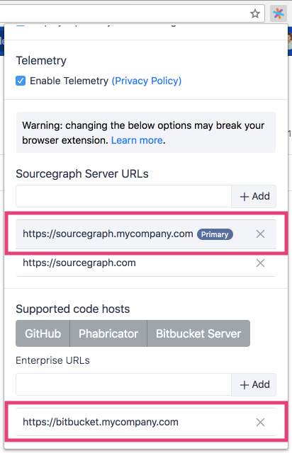

The Sourcegraph browser extension will add **go-to-definition**, **find-references**, **hover tooltips**, and **code search** to all Bitbucket Server files and Pull Requests.

1.  Install the Sourcegraph browser extension for [Chrome](https://chrome.google.com/webstore/detail/sourcegraph/dgjhfomjieaadpoljlnidmbgkdffpack) or [Firefox](https://addons.mozilla.org/en-US/firefox/addon/sourcegraph/).
2.  Add your Sourcegraph URL and Bitbucket Server URL to the options menu as shown below.

    

3.  [Update Sourcegraph site configuration](/docs/config/) to allow scripts on your Bitbucket Server instance to communicate with your Sourcegraph instance:

    ```json
    {
      // ...
      "corsOrigin": "$BITBUCKET_URL"
      // ...
    }
    ```

You're done! You'll now get go-to-definition, find-references, hover tooltips, and code search on Bitbucket Server. Proceed to [install with G Suite](/docs/features/browser-extension#automatically-install-with-g-suite) when you're ready to roll it out to all users.
