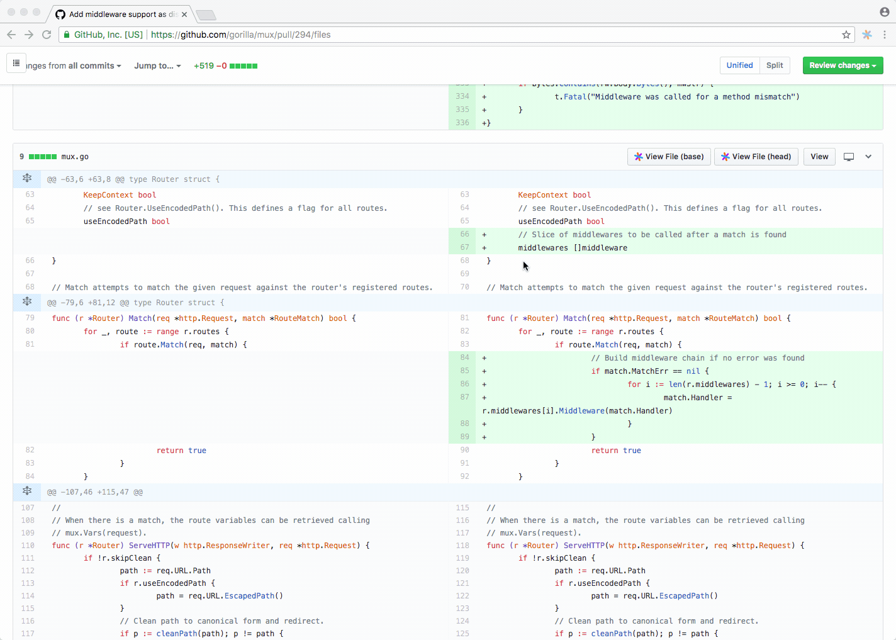

The [open-source](https://github.com/sourcegraph/browser-extensions) Sourcegraph browser extension adds code intelligence to files and diffs on GitHub, GitHub Enterprise, Phabricator, and Bitbucket Server.

1.  Install the browser extension to automatically get code intelligence on public repositories:

    

    <a target="_blank" href="https://chrome.google.com/webstore/detail/sourcegraph/dgjhfomjieaadpoljlnidmbgkdffpack">
    <button class="btn btn-outline-primary align-items-center">
        Chrome
    </button>
    </a>
    &nbsp;
    <a target="_blank" href="https://addons.mozilla.org/en-US/firefox/addon/sourcegraph/">
    <button class="btn btn-outline-primary align-items-center">
        Firefox
    </button>
    </a>

    

2.  To get code intelligence on private repositories:

    1.  [Set up a Sourcegraph instance](/docs).

    2.  [Configure the extension](/docs/features/browser-extension/configuration) to connect to your Sourcegraph instance and code hosts.

## Features

### Code intelligence

When you hover your mouse over code in files, diffs, pull requests, etc., the Sourcegraph extension displays a tooltip with:

- documentation
- type signatures
- "Go to definition" button
- "Find references" button

### Code search

The Sourcegraph extension makes it easy to search on your primary Sourcegraph instance. After you've installed it (see above), use the search shortcut it provides to perform a search:

1.  In the Chrome or Firefox address bar, type <kbd>src</kbd>.
2.  Press <kbd>Tab</kbd> (Chrome) or <kbd>Space</kbd> (Firefox).
3.  Start typing your search query. Select an instant search suggestion or press <kbd>Enter</kbd> or <kbd>Return</kbd> to see all results.
