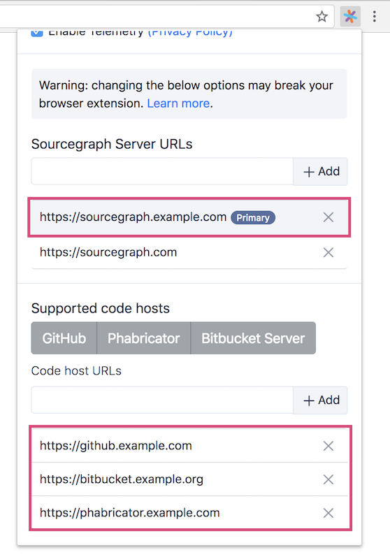
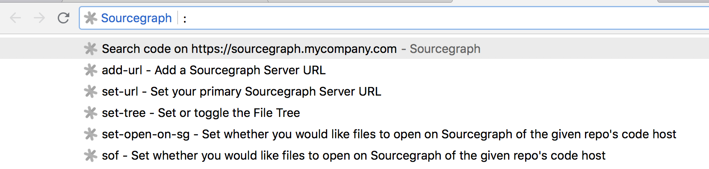

The Sourcegraph browser extension will add **go-to-definition**, **find-references**, **hover tooltips**, and **code search** to all files and diffs on supported code hosts.

By default, the extension will add code intelligence and code search to public repositories. The extension can be configured to work on private code by connecting it to a private Sourcegraph instance.

## Supported code hosts

<div id="integrations-btns" class="btn-group">

<button class="btn btn-outline-primary align-items-center">
    
</button>

<button class="btn btn-outline-primary align-items-center">
    
</button>

<button class="btn btn-outline-primary align-items-center">
    
</button>

<button class="btn btn-outline-primary align-items-center">
    
</button>

<button class="btn btn-outline-primary align-items-center">
    
</button>

</div>

## Configuration for private code

Requirements:

- You must have a [Sourcegraph instance installed](/docs) with [access to your private repositories](/docs/config/repositories).

Browser extension configuration:

1.  Click the Sourcegraph extension icon to open the settings panel. Then, fill in the Sourcegraph Server URL field with your Sourcegraph URL and hit **+ Add**, and fill in the Code Host URL field with your private code host's URL and hit **+ Add**.



2.  [Update your Sourcegraph instance's site configuration](/docs/config/) to allow the extension to communicate with it:

    ```json
    {
      // ...
      "corsOrigin": "https://github.example.com https://gitlab.example.com https://bitbucket.example.org https://phabricator.example.com"
      // ...
    }
    ```

<br />

You're done! You'll now get **code intelligence** in your code hosts for all private repositories that you've added to Sourcegraph.

<br />

### Additional Configuration

There are two ways to view and update the Sourcegraph browser extension's configuration.

#### 1. Extension Icon

Click the Sourcegraph extension icon in your browser's toolbar to open the extension's settings panel.

#### 2. Browser address bar

1.  In the Chrome or Firefox address bar, type <kbd>src</kbd>.
2.  Press <kbd>Tab</kbd> (Chrome) or <kbd>Space</kbd> (Firefox).
3.  Type <kbd>:</kbd> as the first letter of your search query and follow the prompts in the search suggestions.


