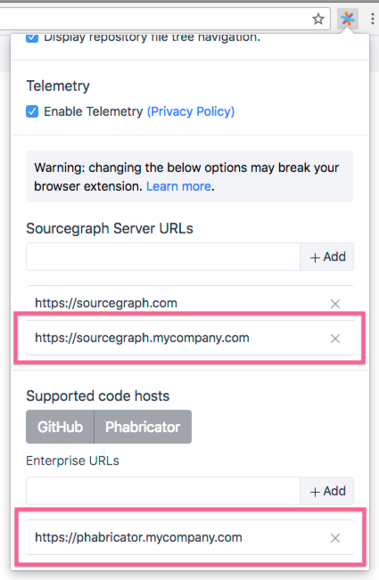

Sourcegraph's Phabricator integration adds Sourcegraph code intelligence and search to Phabricator diffs and code files, so you get go-to-definition, find-references, hover tooltips, and code search embedded natively into Phabricator.

There are two ways to install it:

- For a single user, using a browser extension (recommended for initial testing)
- For all users of the Phabricator instance (recommended for production usage)

## Single-user installation (using a browser extension)

You can use a browser extension to try the Phabricator integration for yourself.

1.  Install the Sourcegraph browser extension for [Chrome](https://chrome.google.com/webstore/detail/sourcegraph/dgjhfomjieaadpoljlnidmbgkdffpack) or [Firefox](https://addons.mozilla.org/en-US/firefox/addon/sourcegraph/).
2.  Add your Sourcegraph URL and Phabricator URL to the options menu as shown below.

    

3.  [Update Sourcegraph site configuration](/docs/config/) to allow scripts on your Phabricator instance to communicate with your Sourcegraph instance:

    ```json
    {
      // ...
      "corsOrigin": "$PHABRICATOR_URL"
      // ...
    }
    ```

You're done! You'll now get go-to-definition, find-references, hover tooltips, and code search on Phabricator. Proceed to the production installation when you're ready to roll it out to all users.

## Production installation (for all users of the Phabricator instance)

For production usage, we strongly recommend installing the Sourcegraph integration for all users (so that each user doesn't need to install the browser extension individually). This involves adding the Phabricator integration to the extension directory of your Phabricator instance.

See the [phabricator-extension](https://github.com/sourcegraph/phabricator-extension) repository for installation instructions and configuration settings.
