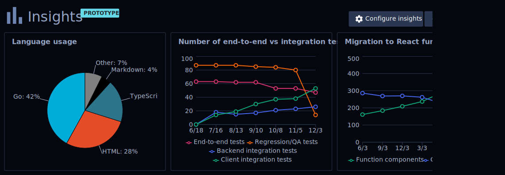

# Code insights team

The code insights team will be responsible for building and delivering [**code insights**](https://docs.google.com/document/d/1EHzor6I1GhVVIpl70mH-c10b1tNEl_p1xRMJ9qHQfoc/edit) to engineering leaders, empowering data-driven decisions in engineering organizations.

## What is code insights?

Code insights is the first feature in Sourcegraph that can tell you things about your code at a **high level**. Here's a [demo](https://www.youtube.com/watch?v=XqeRb6Mc4Co) of a code insights prototype.

Sourcegraph is in the unique position to give these insights because we have universal code search: To know _anything_ about your code at a high level means you must know _everything_ about your code at a low level.

Code insights connects a lot of features that Sourcegraph already has and builds on top of them.
We go beyond single-step code intelligence and search to connect the full cycle of analyzing (code intelligence), monitoring (code insights), and actionably changing a codebase (campaigns).

Code insights will also allow to combine these Sourcegraph-created metrics with other third-party data sources.

Code insights is the first feature primarily built for non-search-based user personas.

## Goals 

**Problem:** Code insights solves two problems. 

1. The Sourcegraph sales cycle is unusual because although we consistently wow our users, the economic decision-maker is usually not one of these users. Instead, the people with the power to sign a contract with us are higher up within an organization and usually depend on running a trial to fully understand the value of Sourcegraph. If code insights answers these personas' higher-level questions about codebases that our core features do not currently answer, it could dramatically speed up our sales cycle as well as our sales pipeline.

1. Sourcegraph has lots of information about your code, but currently only exposes specific, low-level information at the file or directory level. Engineers and engineering managers/directors/VPs have lots of questions about their codebase that Sourcegraph can answer but currently does not. 

**Milestones:**

_Because code insights is an entirely new feature and closely informed by customer feedback, the further in the future goals get, the more flexible the order of these milestones is (especially when it comes to interleaving "business" milestones like beta/GA/paid with feature milestones)._ 

1. 🔄 Code insights prototypes let us gather qualitative feedback to guide the initial product direction. 
1. We can quantitatively measure the adoption of code insights prototypes. 
1. All but the largest customers can use insights prototypes over their entire codebase (there are little to no scaling issues). 
1. Code insights moves from prototype to beta feature (easy to enable or enabled by default, documented, and supported by the CE team rather than the product team). 
1. Code insights beta features are actively used at 5 enterprise customers. 
1. Customers can easily create their own custom insights in the UI. 
1. Code insights integrates natively with other Sourcegraph features like campaigns and code monitoring. 
1. Code insights is GA (generally available) for all customers. 
1. Customers can incorporate third-party data into their insights with plug-and-play UX. 
1. Code insights is a paid product. 
1. Code insights is the primary driver behind 5 enterprise sales. 
1. We have discovered and validated entirely new code metrics that engineering teams should and can use code insights to track. 

**Outcomes:**
- We have weekly quantitative reports on the use of code insights at each customer. 
- Customers communicate to their AE/CE that they use code insights in making engineering decisions. 
- Customers who express explicit interest in the code insights features have a faster sales cycle through our pipeline than our average customer. 
- Customers buy Sourcegraph for the code insights or buy code insights as its own paid feature. 
- Code insights incorporates all of a customer's 3rd-party code information as the central place to learn anything about your code. 
- You can use code monitoring to get alerted when an insight metric hits a trigger. 
- There is a natural path in the UI to go from an insight to a campaign that impacts the value of the insight.

## Roadmap

Our roadmap is in productboard (coming 2020-12-27). 

## We're hiring for this team!

We are building the code insights team by hiring [frontend engineers](../hiring/software-engineer-frontend.md) and [backend engineers](../hiring/software-engineer-backend.md). The engineering manager for this team will be [Felix Becker](../../../company/team/index.md#felix-becker) and the product manager will be [Joel Kwartler](../../../company/team/index.md#joel-kwartler-he-him).
New team members will initially contribute work towards code insights under the umbrella of the [web team](../web/index.md) and split off into their own independent team once we have enough team members.
