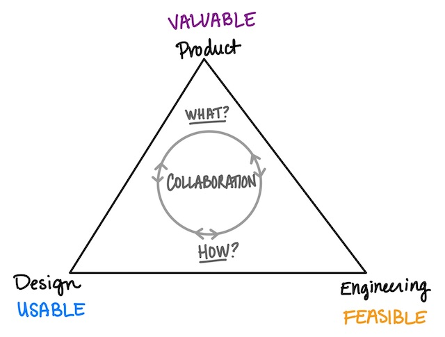

# Product process

## Product planning

- [Planning](../planning.md) - how we do planning and the artifacts we use to plan.
- [Delivery plans](../delivery_plans.md) - how we validate the things we build solve user problems.
- [Tracking issues](../../engineering/tracking_issues.md) - how we keep track of planned and on-going work.
- [Prioritizing](../prioritizing.md) - how we prioritize work, and how to get things prioritized.
- [Tracking user feedback](../user_feedback.md) - sources of feedback and how we keep track of that feedback.
- [Feature rollout](../rollout_process.md) - how we test, rollout and launch new features.

## Definitions

<dl>
    <dt>Goals</dt>
    <dd>Sourcegraph does not do OKRs, we do Goals instead.</dd>
    <dt>Product priorities</dt>
    <dd>An ordered list of problem statements or outcomes that product has evidence is important.</dt>
    <dt>Roadmap</dt>
    <dd>The tasks and timeline for when each will be worked on.</dt>
    <dt>Backlog</dt>
    <dd>The ordered list of items to be tackled after items on the roadmap are complete.</dt>
</dl>

## Responsibilites

Collaboration is at the core of how we think about product planning, and it takes input from all parts of the team to create a great product. Ownership is important for accountability and final decision making, and is why we define responsibilites. We think about ownership broken down by what and how:

- What?
  - Product: is it valuable? why?
- How?
  - Design: is it usable?
  - Engineering: is it feasible?

The product manager is responsible for:

- **Prioritization:** Setting and communicating high-level product priorities.
- **User research and input:** Ensuring engineering teams get the right inputs (customer requirements, good ideas) and get design help. Aggregating and capturing customer feedback, and digging in deeper to learn more.
- **Product vision:** Establishing a vision for the product, and communicating that broadly so there is shared understanding of that vision. Ensuring coherence across all the parts of our product.

Each engineering team, and the engineering manager specifically, is responsible for:

- **Goal planning:** Work with the team to create and update team goals.
- **Development roadmap:** Creating and maintaining the roadmap for their team's product area (and asking product for help getting input or coming up with great ideas as needed). Figuring out what their team is working on, and prioritizing bugs, tech debt, and customer issues along with product related work.
- **Collaboration:** Working with a designer on wires, mocks, and UX.
- **Implementation:** Building and iterating on the solution.

The designer is responsible for:

- TO DO

## Lifecycle of an idea

This is the rough lifecycle of an idea at Sourcegraph.

### 1. Problem identification

- PM is accountable for identifying user problems, product outcomes, driving alignment towards product vision
- Engineering team surfaces customer/user problems that they are aware of.
- Engineering is responsible for identifying engineering investments that need to be made (e.g., architecture improvements, paying down tech debt, productivity investments).
- How will we know that this problem is solved? What do we need to measure?

### 2. Prioritization and goal alignment

- PM provides relative priority and urgency against other product problems.
- PM and EM collaborate to merge the product and engineering priorities into a single prioritized list.

- EM decides that the team’s goal is solve the identified problem (or related), and updates the team's goals.
  - When there is a dedicated PM to a team, the PM is the final decision maker.

It would be useful to describe the ideal outcome. What we want ot end up with is a plan that the engnineering team is bought into and the product team thinks they are the right things. We do not want mercenaries. This will happen if the PM comes with data and arguments, a strong case, for the priorities and what the priorities are. Similarly the EM comes with a case for what they think is important for the engineering team. Together they collaborate to come up with the plan. In the event that the EM and PM can't agree, then the PM gets to make the decision because they are the voice of the user and we value that at Sourcegraph. In the case where there isn't a dedicated PM, then the EM makes the decision they can given the information they have at the time.

- Does the EM need to make a case to the PM for engineering priorities? Who has the burden of proof?
Why is the EM the final decision maker?
Why does the PM not get the final say?
What are risks in this strategy.

Figure out what the eigen vectors are. What are the questions you want to ask about. What is the partiition of the space you care about so you can ask for those dimensions.

### 3. Ideation of possible solutions

Who is accountable in each of the phases?

- Engineering, product, and design come up with many ideas for how to solve the problem.
- Product helps provide scoping and the "appetite" (time investment) we have for solving this problem.
- Engineering decides on the solution direction in collaboration with design.

### 4. Prototype and validate

- Prototype an idea, either in a design mockup, or in an engineering spike, and validate the prototype using UserTesting, customer validation, etc. Design and product are here to help with that.
- Write down and share what you learned from testing the protoype.
- Iterate on the prototype based on feedback, or go back to ideation and pick a different solution to try to protoype.

### 5. Implementation

- Once a solution has been validated, implementaiton begins.
- Engineering team is accountable for the quality of what we implement and deliver to customers (i.e., code, architecture, UX).

### 5. Metrics analysis

- Did the implementation solve the original problem as validated by metrics and usage (defined in step 1).

