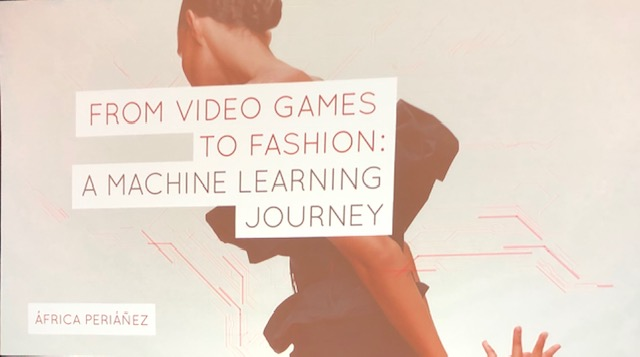
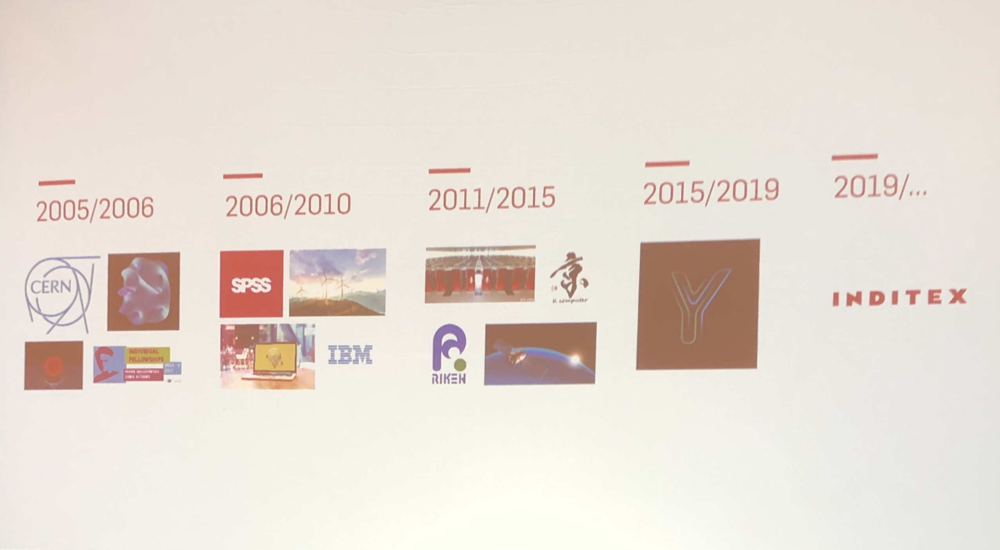
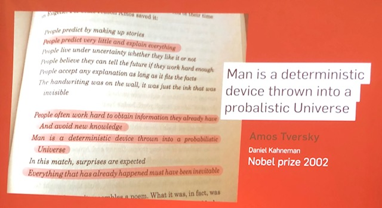
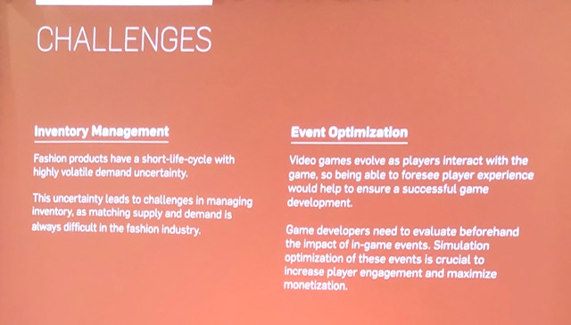
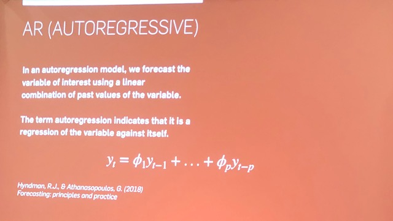
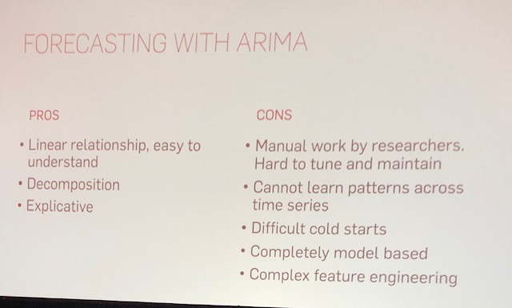
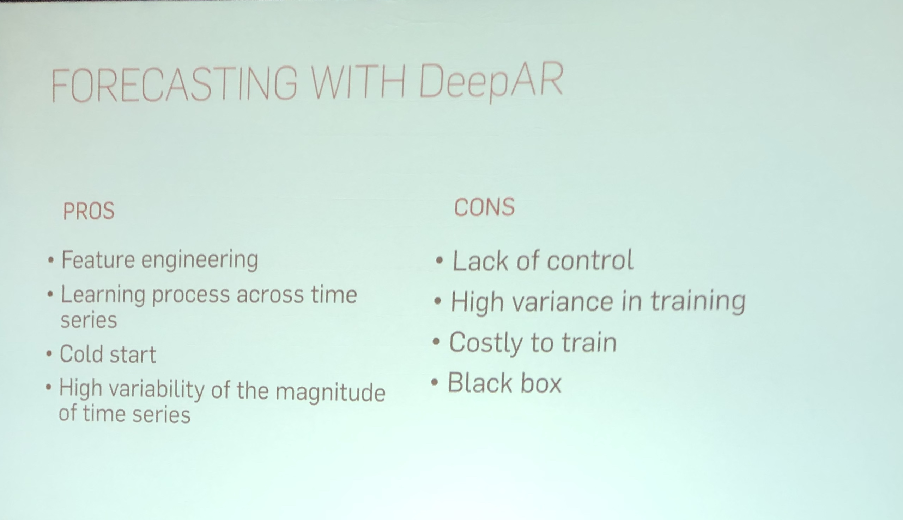
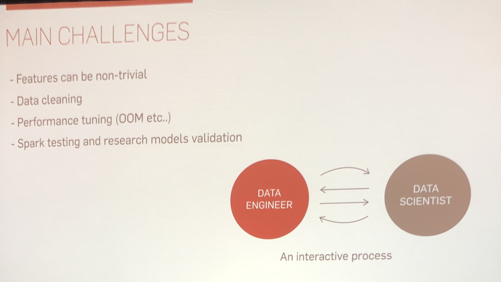
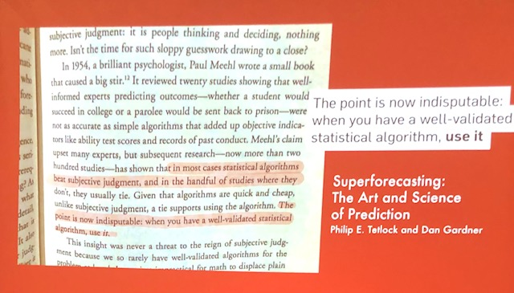

  

      

        Africa Perianez
        <a href="https://twitter.com/aperianez" target="_blank" title="Twitter"><i class="fa fa-twitter pr-2"></i></a>
      

  

---

## Overview

Gaming is a rapidly growing industry. Players generate extremely rich datasets that record each and every in-game action, social interaction, ad view or purchase. Because of the constant and continued relationship between player and game, player behavioral data constitutes a unique source of information on human behavior: a simplified dynamic system that replicates real life. In this talk I will discuss the common challenges to both industries and the emergency of models that scale to really big datasets and manage to capture various kinds of consumer tastes and behaviors. Because of the importance of the temporal dimension, models based on CNN, LSTM or DeepAR play a crucial role to push back this new technological frontier. I will review how these techniques can be used to create customized events and provide personalized predictions.

---

Having recently made a dramatic shift between industries--from video games to fashion--Perianez noted that this was one of the most difficult talks for her to prepare. While she has continued in the practice of predictive forecasting, this work is now in a completely new context. Earlier in her career Perianez worked with academia and atomspheric data sets at CERN, the German weather service and Japanese satellite data. She then moved into the field of video games, where she spent 2015-2019 analyzing and predicting player behavior. 

In the last year Perianez has begun working at Inditex, AI for fashion. Inditex covers whole cycle of fashion, production, distribution, entailing the tracking of complex supply chains. Every piece of unsold clothes is an error of matching supply and demand, so improve their predictions, Inditex keeps track of every single item from production to sale.

### Man is a deterministic device thrown into a probabilistic Universe

Perianez quotes from Amos Tversky and Daniel Kahneman to situate this talk.  "People predict very little and explain everything.... People often work hard to obtain information they already have And avoid new knowledge. Man is a deterministic device thrown into a probabilistic Universe.... Everything that has already happened must have been inevitable." 

In other words, humans are still the hardest problem in machine learning.

### Challenges

For fashion, the central forecasting challenge is Inventory Management. "Fashion products have a short-life-cycle with highly volatile demand uncertainty. This uncertainty leads to challenges in managing inventory, as matching supply and demand is always difficult in the fashion industry."

For video games, the central forecasting challenge is Event Optimization. "Video games evolve as players interact with the game, so being able to foresee player experience would help to ensure a successful game development.  Game developers need to evaluate beforehand the impact of in=game events. Simulation optimization of these events is crucial to increase player engagement and maximize monetization."

### Models Compared

While the specific predictions in video games and fashion differ--predicting player purchases of in-game items vs. consumer purchases of clothing items--they also have much in common, particularly in terms of the role of probalistic forecasting.

 
"In an autogregression model, we forecast the variable of interest using a linear combination of past values of the variable.  The term autoregression indicates that it is a regression of the variable against itself."

Perianez gave an extensive breakdown of how two specific modeling systems--ARIMA and DeepAR--performed across her work. DeepAR is promising, a new product out of Amazon, but it is a third-party black box, which has some drawbacks.

A classic model for forecasting is Autoregressive--such as the Autoregressive Integrated Moving Average (ARIMA). While this algorithm dates back to the Box and Jenkins work from 1976, it is still one of the most used methods for predicting the future based on the past. 

 

For a more thorough exploration of these models and how Perianez and her team implemented them in various contexts, please watch the video of her Strange Loop talk.

### Main Challenges in Summary

 

In summary, the main challenges of Perianez's recent work have been:

* Features can be non-trivial
* Data cleaning
* Performance tuning (OOM etc..)
* Spark testing and research models validation

Despite this, perhaps the greatest challenge she found was communication between Data Engineers and Data Scientists.  With competing priorities and complementary skill sets, the groups need to work hard to stay aligned.

### Conclusions

 

Quoting "Superforecasting: The Art and Science of Prediction," by Philip E. Tetlock and Dan Gardner: "The Point is now indisputable: when you have a well-validated statistical algorithm, *use it*."

We have an array of excellent tools at our disposal.  Now we need to apply them appropriately and make sure we stay focused on shared goals throughout the process of bringing the power of machine learning and probabilistic forecasting to an industry, whether fashion, video games, or some other field.

<!-- Note on images
  Images (e.g. my_image.jpg) should be put in the `website/static/blog/strange-loop-2019` directory, with the path to the image in your post being `/blog/strange-loop-2019/my_image.jpg`. If you'd rather host the images somewhere else for ease of use, that's fine too.

  Please also try to keep your images to a reasonable size by:
    - Using JPEG compression, unless image is mostly solid color 
    - JPEG compression set between 60%-80%
    - Resizing the image to be no wider then 750px
    - If PNG, use a tool like ImageOptim (https://imageoptim.com/mac) to optimize the file size

  I suggest re-sizing and compressing all the images in one batch as a last step.
-->  
